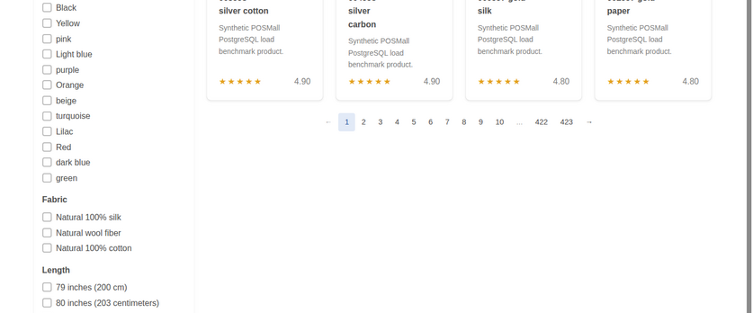
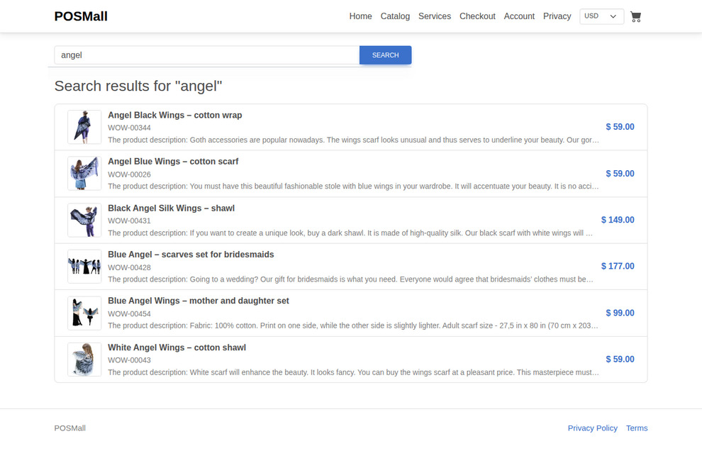
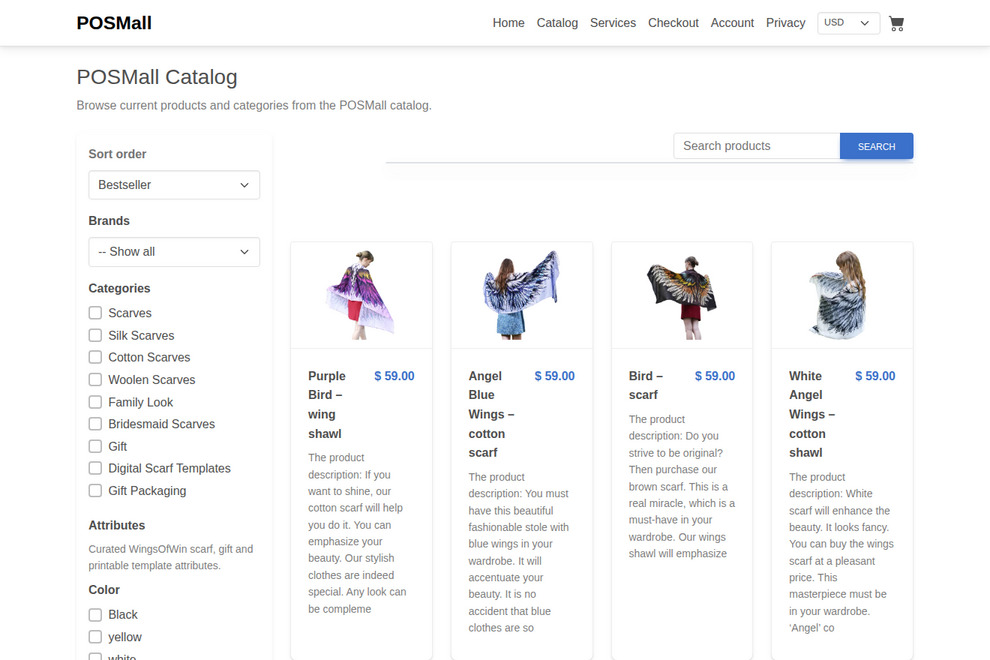
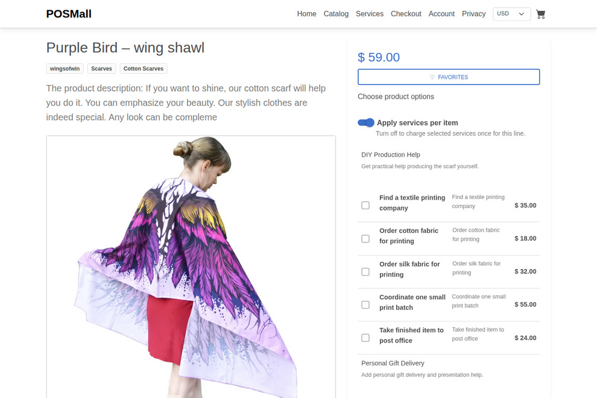
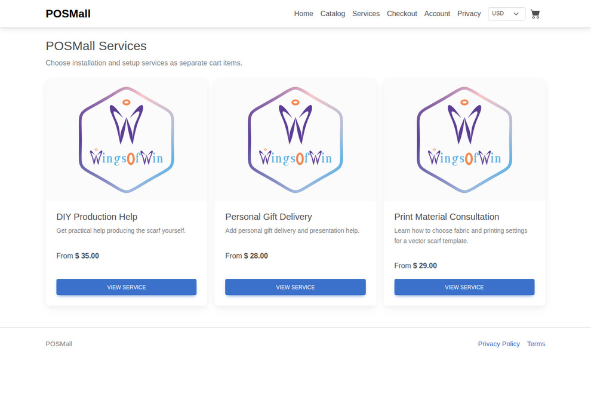
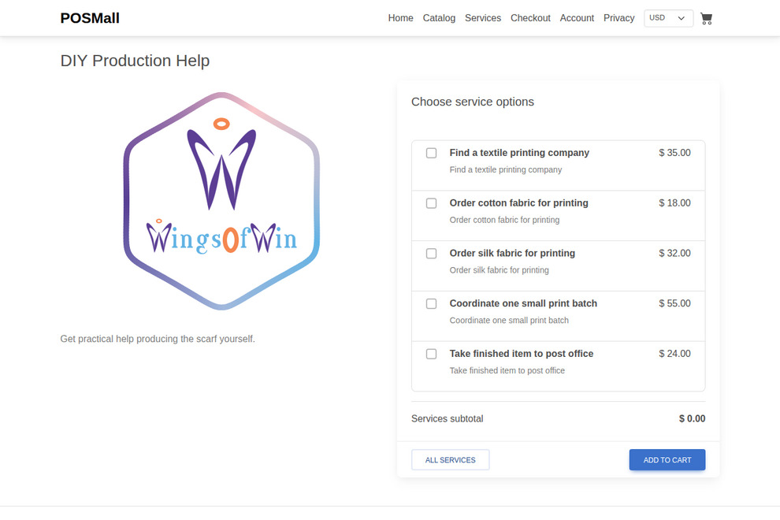
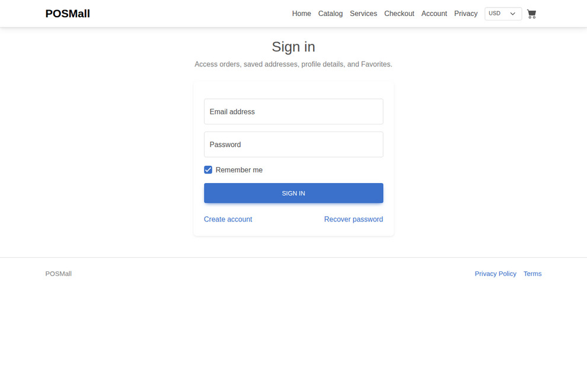
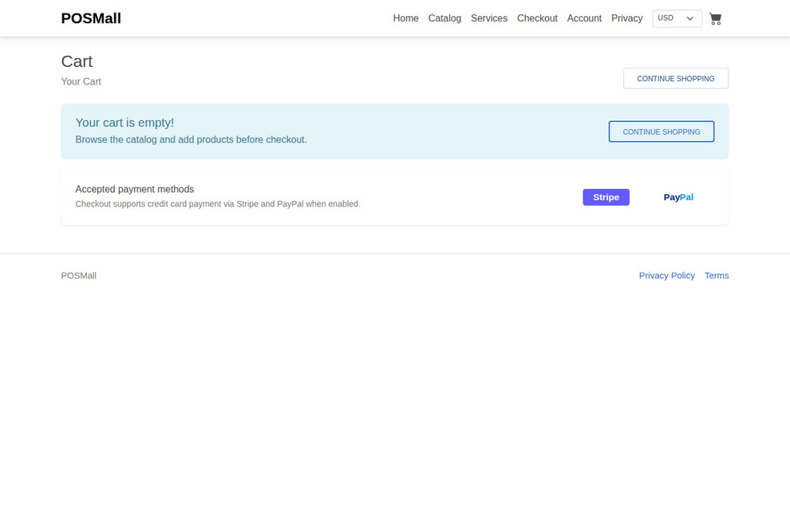
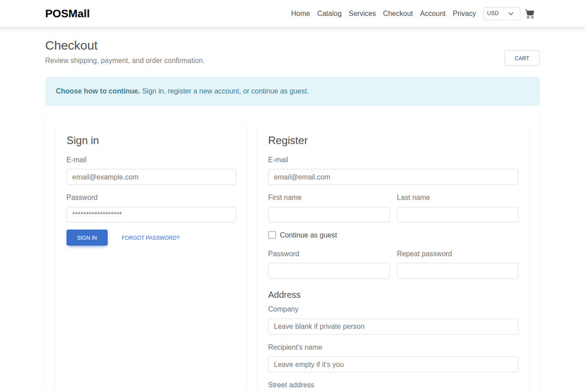
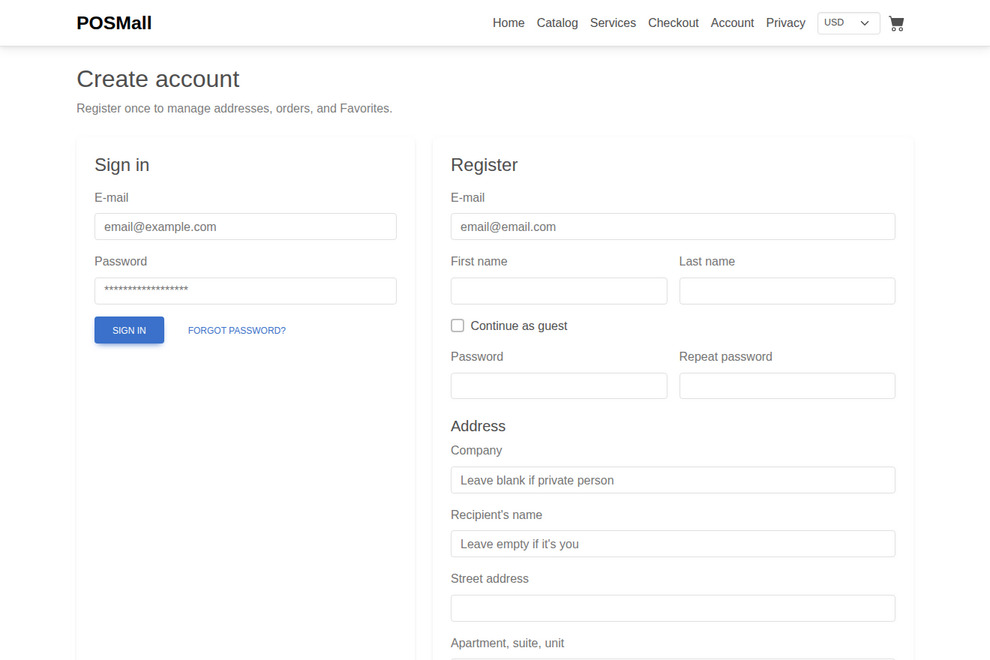

# POSMall Theme - October CMS Storefront for the POSMall eCommerce Plugin



POSMall Theme is the companion October CMS storefront theme for the KodZero POSMall eCommerce plugin. It is designed for PostgreSQL-backed Laravel commerce projects that need a practical storefront for product catalogs, point-of-sale workflows, services, virtual products, cart, checkout, customer accounts, payment links and optimized storefront assets.

- October CMS Marketplace theme page: <https://octobercms.com/theme/kodzero-posmalltheme>
- October CMS Marketplace plugin page: <https://octobercms.com/plugin/kodzero-posmall>
- POSMall Theme repository: <https://github.com/TjoBiZ/POSMallTheme>
- POSMall eCommerce plugin repository: <https://github.com/TjoBiZ/POSMall>

Install the POSMall plugin first. The theme uses the plugin's October CMS components, pages, routes, image helpers, cart logic, checkout flow, service catalog logic, virtual product support, customer account flows and storefront optimization settings.

## Storefront Screenshots

| Search | Catalog filters |
| --- | --- |
|  |  |

| Product detail | Services |
| --- | --- |
|  |  |



## Customer Flow Screenshots

| Favorites and login | Cart |
| --- | --- |
|  |  |

| Checkout registration | Account registration |
| --- | --- |
|  |  |

## What This Theme Provides

- SEO-ready storefront pages for October CMS and Laravel eCommerce projects.
- Catalog, category, product detail and search pages connected to the POSMall plugin.
- Service catalog and service detail pages for paid service options.
- Virtual product and downloadable product storefront support.
- Cart, checkout, payment-link and customer account pages.
- Responsive POSMall navigation, privacy/terms pages and storefront UI assets.
- Product, service, favorite-list, cart and order image display using POSMall optimized image derivatives.
- Laravel Mix / PageSpeed-ready CSS and JavaScript build flow.
- SVG POSMall logo and theme metadata prepared for the public `TjoBiZ/POSMallTheme` repository.

## Required Companion Plugin

This theme is not a standalone eCommerce engine. It is the visual storefront for:

```text
https://github.com/TjoBiZ/POSMall
```

The plugin provides the business logic: PostgreSQL product index, catalog filters, prices, variants, stock, cart, checkout, orders, payments, shipping, taxes, discounts, reviews, services, virtual products, API routes and backend administration.

The theme provides the customer-facing pages and optimized storefront presentation.

## Installation

Install the POSMall plugin and the companion theme through Composer:

```bash
cd /path/to/octobercms

composer require kodzero/posmall-plugin kodzero/posmalltheme-theme -W

php artisan october:migrate
php artisan theme:use kodzero-posmalltheme --force
php artisan cache:clear
php artisan config:clear
php artisan route:clear
php artisan view:clear
```

The POSMall plugin migration creates the baseline commerce settings required for a clean
installation. POSMall uses USD as the default currency after installation.

Activate the theme from the October CMS backend or with the October CMS theme tools available in your project.

Marketplace pages:

- Theme: <https://octobercms.com/theme/kodzero-posmalltheme>
- Plugin: <https://octobercms.com/plugin/kodzero-posmall>

## Quick Demo Catalog / Test Products

After installing the POSMall plugin and activating this theme, populate the store with the curated
WingsOfWin test catalog for a ready demo storefront. This command creates a realistic small shop
with roughly forty product examples, service examples, virtual-product examples, prices,
properties, images and related catalog data.

Run this only on a new demo, staging or evaluation store. The `--force` flag is intentionally
destructive for catalog data: it replaces the local POSMall catalog with the bundled demo dataset.
Do not run it on a production store that already contains real products.

```bash
php artisan posmall:seed-wings-of-win --force
php artisan posmall:index --force
php artisan posmall:images:optimize-catalog --profile=all
php artisan cache:clear
php artisan view:clear
```

After the command finishes, open this theme's catalog, services and product pages to review the
generated demo storefront.

## Recovery After Interrupted Composer Install

If a previous install was interrupted, or Git reports `detected dubious ownership`, reset the
POSMall package paths and run the Composer source install again:

```bash
cd /path/to/octobercms

APP_USER="$(id -un)"
WEB_GROUP="www-data"

jobs -p | xargs -r kill -9 2>/dev/null || true

sudo rm -rf plugins/kodzero/posmall themes/kodzero-posmalltheme themes/kodzero-posmall themes/posmall themes/POSMall
sudo rm -rf vendor/kodzero/posmall-plugin vendor/kodzero/posmalltheme-theme
sudo find vendor/composer -maxdepth 1 -type d \( -name 'tmp-*' -o -name '*TjoBiZ-POSMall*' -o -name '*TjoBiZ-POSMallTheme*' \) -exec rm -rf {} + 2>/dev/null || true

sudo mkdir -p plugins/kodzero themes vendor/kodzero
sudo chown -R "$APP_USER:$WEB_GROUP" plugins/kodzero themes vendor/kodzero vendor/composer composer.json composer.lock
sudo chmod -R ug+rwX plugins/kodzero themes vendor/kodzero vendor/composer

git config --global --add safe.directory "$(pwd)/plugins/kodzero/posmall"
git config --global --add safe.directory "$(pwd)/themes/kodzero-posmalltheme"

composer config --unset repositories.posmall || true
composer config --unset repositories.posmall-theme || true
composer config --unset repositories.posmall-local || true
composer config --unset repositories.posmall-theme-local || true

composer clear-cache
composer require kodzero/posmall-plugin kodzero/posmalltheme-theme -W

composer dump-autoload
php artisan october:migrate
php artisan theme:use kodzero-posmalltheme --force
php artisan cache:clear
php artisan config:clear
php artisan route:clear
php artisan view:clear
```

## Development Source Install

Use direct GitHub VCS repositories only for local development, release verification, or unreleased
`main` branch testing before the October Marketplace package has been rebuilt.

```bash
cd /path/to/octobercms

composer config repositories.posmall '{"type":"vcs","url":"https://github.com/TjoBiZ/POSMall.git","no-api":true}'
composer config repositories.posmall-theme '{"type":"vcs","url":"https://github.com/TjoBiZ/POSMallTheme.git","no-api":true}'

composer require kodzero/posmall-plugin:dev-main kodzero/posmalltheme-theme:dev-main -W --prefer-source --no-interaction

php artisan october:migrate
php artisan theme:use kodzero-posmalltheme --force
php artisan cache:clear
php artisan config:clear
php artisan route:clear
php artisan view:clear
```

## Direct Git Fallback

Use this only when Composer source install is unavailable on a specific server. Composer source
install above remains the normal path.

```bash
cd /path/to/octobercms

APP_USER="$(id -un)"
WEB_GROUP="www-data"

sudo rm -rf plugins/kodzero/posmall themes/kodzero-posmalltheme themes/kodzero-posmall themes/posmall themes/POSMall
sudo mkdir -p plugins/kodzero themes

git clone --depth 1 https://github.com/TjoBiZ/POSMall.git plugins/kodzero/posmall
git clone --depth 1 https://github.com/TjoBiZ/POSMallTheme.git themes/kodzero-posmalltheme

sudo chown -R "$APP_USER:$WEB_GROUP" plugins/kodzero/posmall themes/kodzero-posmalltheme
sudo chmod -R ug+rwX plugins/kodzero/posmall themes/kodzero-posmalltheme

composer dump-autoload
php artisan october:migrate
php artisan cache:clear
php artisan config:clear
php artisan route:clear
php artisan view:clear
```

## Storefront Assets

Readable source assets live under:

```text
themes/kodzero-posmalltheme/assets/posmall/css
themes/kodzero-posmalltheme/assets/posmall/js
```

Laravel Mix entry files live under:

```text
themes/kodzero-posmalltheme/assets/src
```

To build optimized storefront assets:

```bash
cd themes/kodzero-posmalltheme/assets
npm install
npm run prod
```

The POSMall plugin can also rebuild PageSpeed-ready assets through its backend tools and artisan commands when the project is configured for optimized storefront assets.

## SEO Keywords

October CMS eCommerce theme, Laravel eCommerce theme, PostgreSQL eCommerce storefront, POS theme, product catalog theme, service catalog theme, virtual products theme, checkout theme, cart theme, OctoberCMS shop theme, Laravel shop theme, POSMall theme, POSMall plugin storefront.

## License

See `LICENSE.md` in this theme repository and the companion plugin licensing notes in:

```text
https://github.com/TjoBiZ/POSMall
```
